#Tuto_Jenkins
## Installation

```bash
sudo wget -O /etc/apt/keyrings/jenkins-keyring.asc \
  https://pkg.jenkins.io/debian-stable/jenkins.io-2023.key
echo "deb [signed-by=/etc/apt/keyrings/jenkins-keyring.asc]" \
  https://pkg.jenkins.io/debian-stable binary/ | sudo tee \
  /etc/apt/sources.list.d/jenkins.list > /dev/null
sudo apt-get update
sudo apt-get install jenkins
```
## Start Jenkins
```bash
### Activé Jenkins
sudo systemctl enable jenkins

### Start Jenkins Service
sudo systemctl start jenkins

### Tu peux vérifier
sudo systemctl status jenkins
```

## Page Web Jenkins
#### http://localhost:8080
```bash
### Effectuer cette commande pour avoir le mdp
sudo cat /var/lib/jenkins/secrets/initialAdminPassword
```
## Configuration Master-Agent Jenkins

Ce tutoriel vous guide dans la configuration du **mode Master-Agent** dans Jenkins.

---

### Étape 1 : Configuration de l'agent Jenkins

### 1. Accéder à l’interface Jenkins

- Cliquez sur **« Configurer un agent »**.
  
  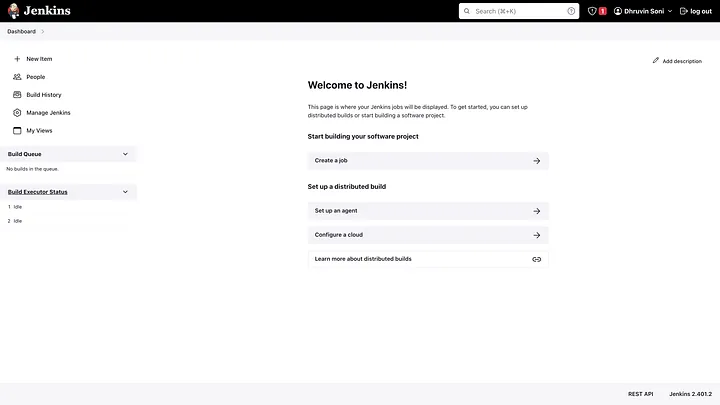
- Cliquez sur **« Nouveau nœud »** et donnez un **nom** à votre agent.
  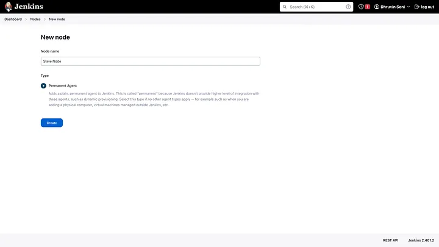
---

### 2. Configurer le nœud agent
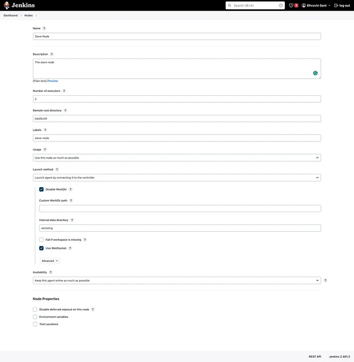

Renseignez les informations suivantes :

- **Description :** *(Optionnel)* Ajoutez une description pour identifier l’agent.
- **Nombre d’exécuteurs :**  
  Le nombre de tâches parallèles que cet agent peut exécuter.  
  Exemple : `2`

- **Répertoire racine distant :**  
  Jenkins stocke les espaces de travail ici.  
  Étant donné que Jenkins n’est pas installé sur le nœud agent, définissez un répertoire comme :  
  `/opt/build`

- **Étiquettes (Labels) :**  
  Ajoutez une ou plusieurs étiquettes personnalisées (ex. : `build-node`, `linux`, `agent-01`) afin de cibler ce nœud lors de l’exécution d’un job.

- **Utilisation :**  
  Choisir :  
  `Utiliser ce nœud autant que possible`

- **Méthode de lancement :**  
  Sélectionner :  
   `Lancer l’agent en se connectant au contrôleur`

- **Désactiver WorkDir :**  
  ✅ Cochez cette case

- **Disponibilité :**  
  Choisir :  
  `Garder cet agent en ligne autant que possible`

Cliquez sur **Enregistrer**.

---

### 3. Connexion de l’agent à partir du nœud master

Après avoir enregistré, vous verrez une commande à exécuter.
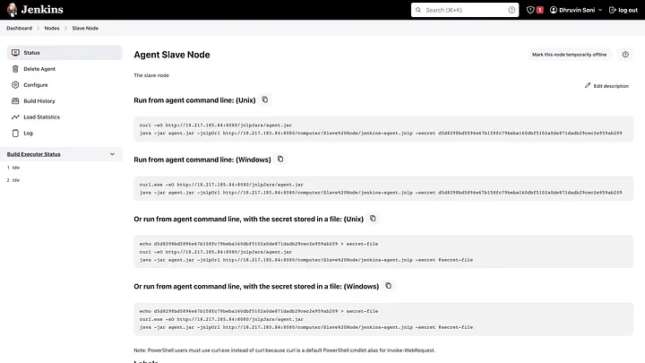

Exécutez cette commande sur votre nœud principal (master/controller) :

```bash
# Exemple de commande donnée par Jenkins :
java -jar agent.jar -jnlpUrl http://<jenkins-url>/computer/<nom-agent>/slave-agent.jnlp -secret <clé-secrète> -workDir "/opt/build"
```

Une fois la commande exécutée, l’agent devrait apparaître comme **Connecté** dans le tableau de bord Jenkins.
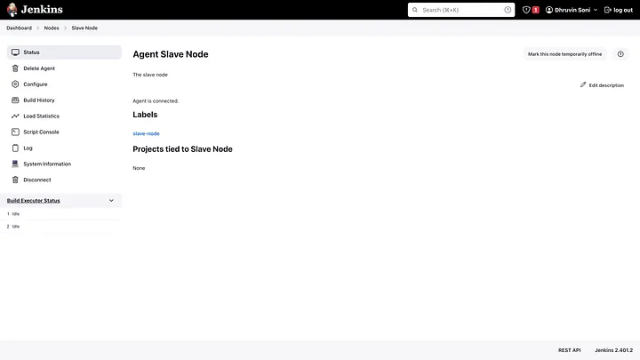

---

### Tester la configuration avec un job

### 1. Créer un nouveau job
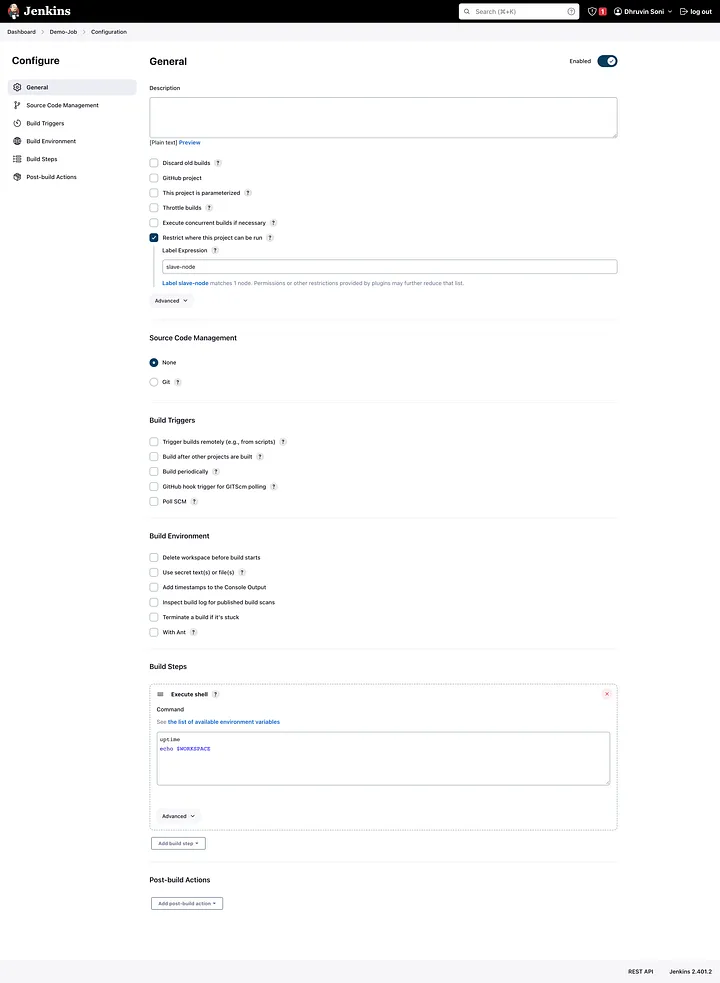


- Allez dans **Nouvel élément**
- Donnez un nom à votre projet (ex. : `Job-Demo`)
- Sélectionnez **Projet de style libre**
- Cliquez sur **OK**

### 2. Configurer le job

- Cochez **« Restreindre l’exécution du projet à un nœud spécifique »**
- Dans **Expression d’étiquette**, entrez le **label** de votre nœud agent (ex. : `agent-01`)
- Dans **Étapes de build**, choisissez **Exécuter un script shell** et ajoutez :

```bash
uptime
echo $WORKSPACE
```

Cliquez sur **Sauvegarder** puis **Appliquer**.

---

### 3. Lancer le job

Avant de lancer, vérifiez le temps de fonctionnement (uptime) de votre agent :
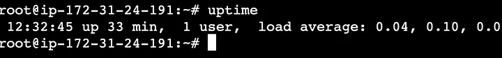


```bash
uptime
# Exemple de sortie :
# 33 minutes
```

Cliquez ensuite sur **Construire maintenant (Build Now)** dans Jenkins.
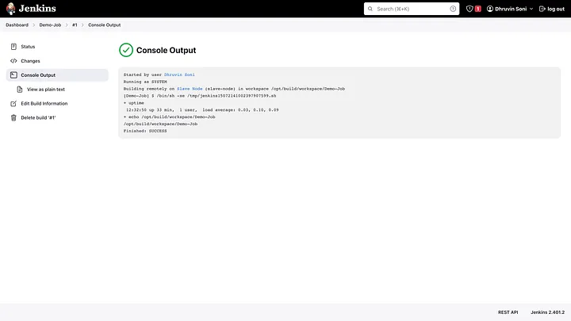


Vous verrez :

- Le temps de fonctionnement de l’agent
- Le chemin de l’espace de travail : `/opt/build/workspace/Job-Demo`

---

### Conclusion

Votre **configuration Master-Agent est prête !**  
Vous pouvez maintenant créer plusieurs jobs et les exécuter sur les nœuds agents selon vos besoins. 

### Jenkins et GitHub : Intégration via PollSCM, Chaînes de Jobs et Déclencheurs Distants (git hooks)

#### Intégration de Jenkins avec des hooks Git locaux et déploiement du code source dans des conteneurs Docker à l’aide de déclencheurs PollSCM.


---

###### Étape 1

Déploiement de l’environnement de **test** sur Docker en utilisant un **hook Git (post-commit)**  
lorsqu’un commit est effectué depuis une branche de développement (autre que `master`)  
et que le job est planifié via **PollSCM**.

**Hook Git utilisé : `post-commit`**

Créer ou éditer le fichier :
```bash
vi .git/hooks/post-commit
```

Contenu du script :
```bash
#!/bin/bash
echo "D'abord <git fetch>, puis les tâches post-commit commencent"
git fetch
git push
echo "Le git push est terminé vers la branche distante actuelle"
# echo "Déclenchement distant du build Jenkins via URL"
# curl --user "<utilisateur>:<motdepasse>" <URL_Déclencheur_Distant>
```

📸 Configuration 1 :
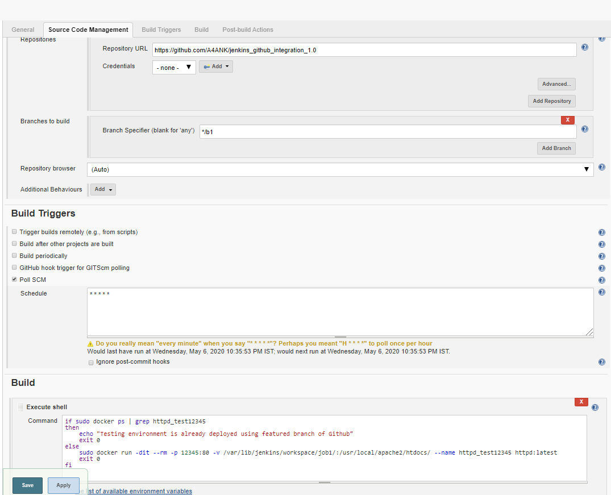

---

###### Étape 2

Déploiement de l’environnement de **production** uniquement lorsqu’il y a des modifications sur la branche `master`  
(planifié via **PollSCM**).

📸 Configuration 2 :
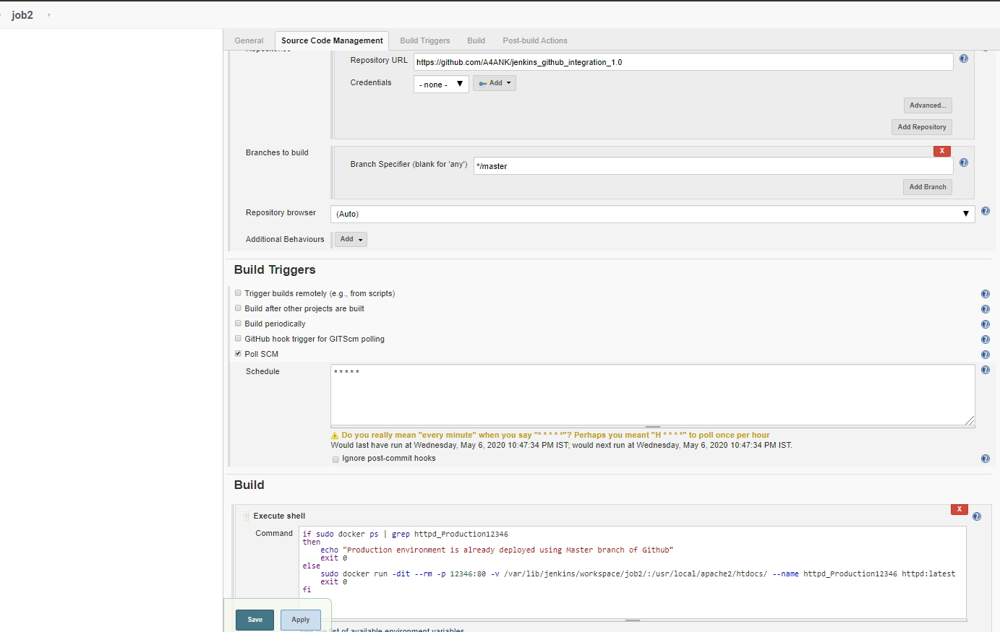

---

###### Étape 3

Fusion de la branche de développement vers la branche `master` (branche principale),  
déclenchée à distance via :

```
http://<jenkins-url>/job/job3/build?token=TOKEN
```

Authentification requise avec les identifiants Jenkins.

Si ce job est exécuté avec succès, il déclenche automatiquement le **Job 2**.  
Ce job est également planifié avec **PollSCM**.

📸 Configuration 3 :
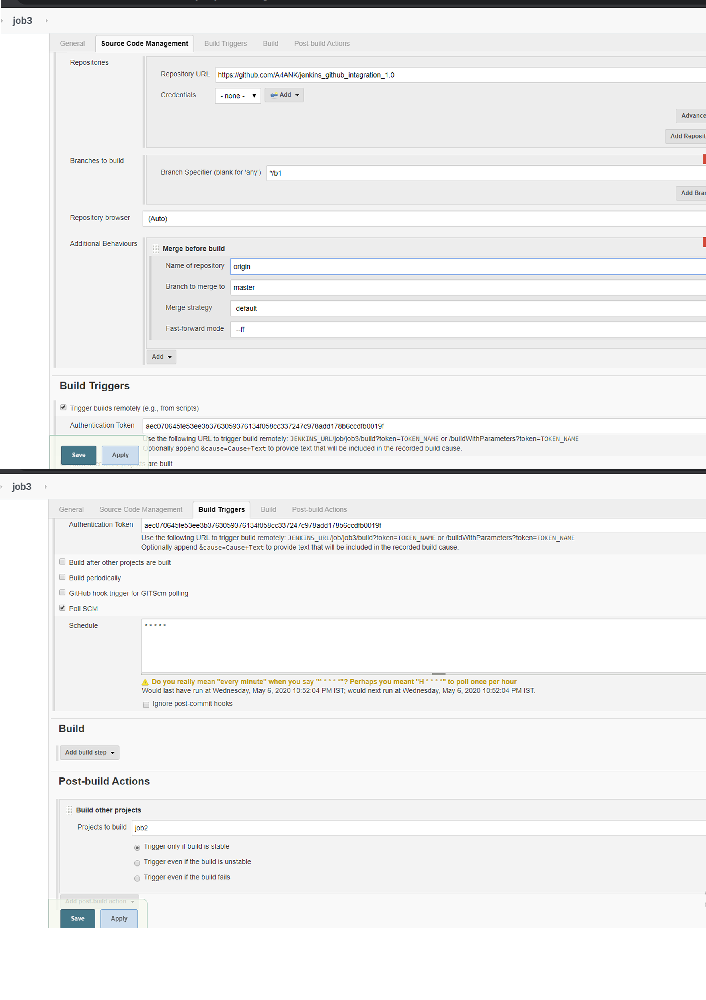


